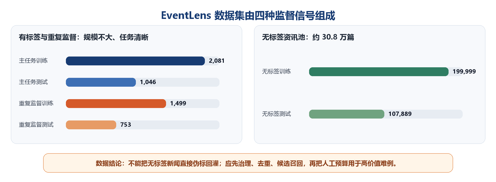
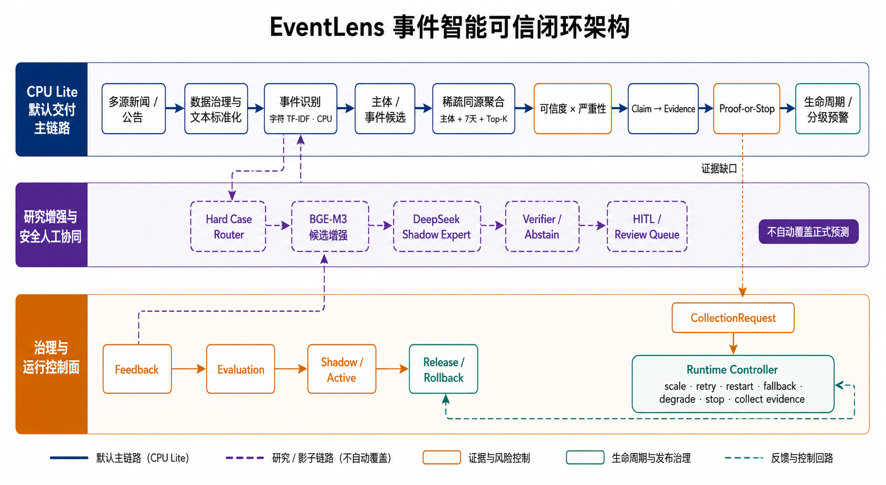
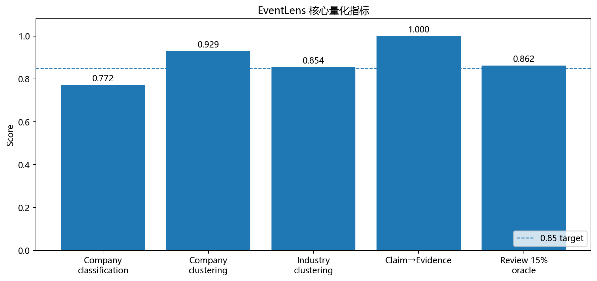
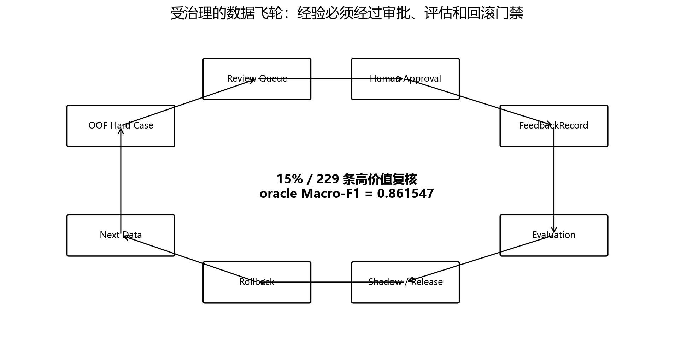

# EventLens 技术文档（初赛提交版）

## 目录

1. [先从一个真实场景理解赛题](#1-先从一个真实场景理解赛题)
2. [数据集告诉了我们什么](#2-数据集告诉了我们什么)
3. [从数据分析到方案敲定](#3-从数据分析到方案敲定)
4. [EventLens 如何把新闻变成可信事件](#4-eventlens-如何把新闻变成可信事件)
5. [什么情况下 EventLens 更有优势](#5-什么情况下-eventlens-更有优势)
6. [总体架构与关键设计](#6-总体架构与关键设计)
7. [量化结果与实际效果](#7-量化结果与实际效果)
8. [人机协同与受治理的数据飞轮](#8-人机协同与受治理的数据飞轮)
9. [技术路线选择与失败尝试](#9-技术路线选择与失败尝试)
10. [原创亮点、落地部署与边界](#10-原创亮点落地部署与边界)
11. [复现与交付](#11-复现与交付)
12. [总结与后续演进](#12-总结与后续演进)
13. [现有成果引用与原创边界](#13-现有成果引用与原创边界)

## 摘要

金融资讯系统最怕两件事：**重要事件被漏掉，或同一件事被反复、错误地推送**。传统新闻分类系统通常逐篇处理文章，能回答“这篇新闻像哪一类”，却很难回答业务人员真正关心的问题：它说的是哪家公司、是不是同一件事、证据是否充分、事情有没有后续变化、现在是否应该预警。

EventLens 的做法是把分散新闻整理成一份持续更新的“事件档案”：先识别事件，再把转载、改写和后续报道归到一起；所有高风险结论都必须能回指原文证据，证据不足就暂缓推送并进入补采或人工复核。默认交付路径可在普通 CPU 环境离线运行，不依赖 GPU 和外部大模型 API。

这套方案不是为了堆叠更多模型，而是为了在真实环境中同时解决四个问题：**看得懂、合得准、说得清、停得住**。当前严格个股研究评测 Macro-F1 为 `0.772131`，个股/行业同源聚合 Pairwise F1 为 `0.929172/0.853907`；全部高风险结论均可回指证据，故障注入中未出现越权继续运行。

## 1. 先从一个真实场景理解赛题

### 1.1 一件事，为什么会变成三次告警

下面是一个经过抽象和脱敏的示意案例，并非对原始数据的复述：

> 上午，媒体 A 报道“某公司收到交易所问询函”；中午，媒体 B 改写为“公司回应监管问询”；第二天，官方公告要求公司补充披露。三篇文章措辞不同、发布时间不同，但讲的是同一件事的三个阶段。

逐篇分类系统可能给业务人员推送三次“监管处罚”告警。问题随之出现：前两篇是否只是转载？问询是否已经升级为处罚？第三篇官方公告出现后，前面的判断是否应该更新？如果系统只留下三个标签，这些问题都无法回答。

EventLens 会建立一份事件档案：

1. 识别主体和事件类型，先判断文章大致在讲什么；
2. 将同一主体、相近时间、语义相关的报道归入同一事件；
3. 保存每一条判断对应的原文证据和来源；
4. 随新报道到来更新“首次出现、官方确认、补充披露、澄清或升级”等状态；
5. 证据达到门槛才允许高风险预警，否则进入补采或人工复核。

对使用者而言，变化很直观：原来的“三条新闻、三次告警”，变成“一件事、一条脉络、一次有依据的判断”。

### 1.2 赛题真正考查的不是单篇分类

赛题同时要求事件识别、可信评估、同源聚合、脉络追踪和影响预警。这五项能力彼此依赖：事件类型判断错了，后续聚合会错；转载没有合并，告警会轰炸；证据不足却直接推送，金融场景的误报成本会被放大。

因此我们把目标从“给每篇新闻贴标签”重构为“形成可追溯、可更新、可安全交付的事件判断”。这也是后续所有技术选择的统一标准：不仅看分数，还要看它是否能减少重复、保留证据、适应有限算力，并在不确定时安全停止。

## 2. 数据集告诉了我们什么

### 2.1 数据由四类信号组成



数据不是一张可以直接训练的普通分类表，而是四类用途不同的信号：

| 数据类型 | 规模与内容 | 能解决什么问题 | 使用原则 |
|---|---|---|---|
| 事件分类 Gold | 训练集 2,081 条，测试集 1,046 条 | 学习个股和行业事件类别 | 只用于事件识别与严格评测 |
| 重复新闻监督 | 训练集 1,499 条，测试集 753 条 | 学习哪些文章属于同一事件 | 按 `duplication_id` 分组，防止同簇泄漏 |
| 无标签资讯池 | 训练 199,999 条，测试 107,889 条 | 模拟真实新闻流、支撑候选检索和数据治理 | 不把机器猜测直接当作真值 |
| 事件 Schema | 84 个公司主体、17 个行业及事件描述 | 提供业务词典与候选约束 | 作为弱先验，不当作答案 |

这一步分流非常重要。若把“重复新闻”误当作事件分类样本，模型会学到错误目标；若把 30 多万条无标签数据直接伪标后回灌，少量错误会被成倍放大。EventLens 因而先确定每类数据能做什么，再决定模型怎么用它。

### 2.2 小标注、长尾类别，意味着不能依赖“背题”

个股训练集只有 1,525 条，却覆盖 44 个事件类别，其中 7 类不足 10 条；最多类别有 248 条，最少只有 5 条，数量相差约 50 倍。行业训练集 556 条、20 类，也有类别仅 3 条。

通俗地说，这像让一个新人只看几份稀有案例，就要识别未来所有新写法。复杂模型很容易记住训练样本中某家公司或某个固定词，却未必真正学会事件含义。为此我们采用对简称、数字、公告固定表达更稳定的字符特征作为 CPU 主分类器，并把主体和 Schema 只作为候选提示，而不是决定答案的捷径。

### 2.3 无标签数据很多，更需要治理而不是盲目扩充

无标签资讯约 30.8 万条，是主分类训练 Gold 的约 148 倍。数量大并不等于可以直接用于训练：审计发现无标签训练集与测试集存在 2,696 个完全相同标题和 543 个完全相同正文，说明真实新闻流中有大量转载和重复。

这条数据事实直接推动了两项设计：一是先做同源聚合，避免重复新闻放大舆情；二是把无标签数据用于候选检索、离线向量和人工复核队列，而不是未经审核就写入 Gold。

### 2.4 数据边界决定了我们如何解释成绩

当前个股测试集中的 82 个公司主体都在训练集中出现过，因此测试更接近“已知公司在新时间、新写法下的泛化”，不能宣称已经证明对全新公司的零样本能力。数据来源也存在集中现象，例如新浪在个股训练集中约占 24.2%，在行业训练集中约占 42.1%。

所以评测除了随机划分，还必须关注时间、来源和主体捷径。报告明确区分严格 production-like 研究评测与默认离线交付路径，不把带标签主体真值的历史成绩当作生产成绩，也不把当前测试集覆盖不到的能力包装成结论。

## 3. 从数据分析到方案敲定

我们不是先选模型再找理由，而是让数据特征逐项决定方案。

| 数据现象或业务风险 | 方案选择 | 为什么这样选 | 给使用者的好处 |
|---|---|---|---|
| 2,081 条分类 Gold 要覆盖 64 类事件 | 字符 TF-IDF + 线性分类器承担主流量 | 小样本下更稳定，能识别简称、数字和固定公告表达 | 普通 CPU 即可快速运行，也更容易复现 |
| 类别长尾且主体容易成为捷径 | Schema 只做弱先验和 Top-K 候选 | 提供业务知识，但不让“公司名字”直接决定事件 | 面对新表述时更不容易机械套标签 |
| 30.8 万条无标签数据包含大量转载 | 主体、时间、语义构成稀疏候选边 | 不做全量两两比较，也不重复推送 | 新闻越密集，去重与聚合价值越明显 |
| 金融误报成本高，模型分数不是事实 | Claim→Evidence + Proof-or-Stop | 每条高风险判断必须附证据；证据不足就停 | 业务人员知道“为什么”，也能追溯原文 |
| 事件会被确认、澄清、反驳或升级 | 追加式生命周期账本 | 新信息不覆盖历史，而是形成状态版本 | 能看到事情如何变化，而非只看静态标签 |
| GPU、网络和外部 API 不一定可用 | CPU Lite 默认交付，BGE/LLM 可选增强 | 把关键能力放在最稳定的运行条件上 | 标准环境可验收，成本和故障面可控 |
| 人工审核预算有限 | 风险优先的 Review Queue | 把人力集中到不确定、高影响样本 | 同样审核量覆盖更有价值的案例 |

最终形成的不是一个孤立模型，而是一套轻量主链路、证据安全门、事件账本和人工闭环。模型负责“看懂”，规则和证据负责“允许做什么”，两者职责分开。

## 4. EventLens 如何把新闻变成可信事件

### 4.1 第一步：把不同来源整理成统一记录

不同数据表对标题、正文、主体和重复关系的表达并不一致。系统先统一成 `ArticleRecord`，保留来源、发布时间、原始行号和任务范围。这样即使后续判断出现问题，也能回到最初数据，知道哪条信息从哪里来、经历了哪些处理。

### 4.2 第二步：先给出候选，再做最终判断

主分类器根据标题、来源和正文识别事件；BGE-M3 在研究增强路径中负责寻找相似主体、事件定义和历史案例。它不直接替代主分类器，而是提供 Top-K 候选和上下文。

这种分工类似“初筛 + 参考资料”：主分类器稳定处理绝大多数新闻，语义模型帮助发现近义表达和难例。SVC+BGE 联合 Top-5 对 OOF 分类错误的真值覆盖约 93.16%，说明多数难例的正确答案已经进入候选，后续重点是谨慎决定 Top-1，而不是无边界增加模型规模。

### 4.3 第三步：把多篇报道合成一件事

系统先按主体、7 天时间窗口和近邻候选缩小比较范围，再结合事件类别、规则特征和语义相似度聚类。全量文章无需彼此两两比较，复杂度和误合并风险都更可控。

聚合后的核心对象不再是一篇新闻，而是一个 `Event Cluster`：其中保存所有相关报道、代表证据、首次和最新出现时间。对业务人员来说，这相当于从“新闻收件箱”升级为“事件台账”。

### 4.4 第四步：证据够了才允许高风险推送

EventLens 不把模型置信度等同于事实可信度。每个高风险告警都必须形成 Claim→Evidence 关系，并满足至少两条独立来源，或一条达到门槛的官方证据。若条件不足，系统保留事件，但将 `delivery_allowed` 设为 false，同时生成补采请求。

这就是 Proof-or-Stop：要么给出能够支持结论的证据，要么停在安全边界。它将“模型认为像”与“业务允许推送”明确分开。

### 4.5 第五步：跟踪变化，而不是覆盖过去

后续报道到来后，生命周期账本追加新的证据、状态版本和可信度快照。官方确认、澄清、反驳或影响升级都会改变当前判断，但历史记录仍然保留。

因此，当业务人员问“为什么昨天暂缓、今天却升级预警”时，系统可以给出完整变化链，而不是只显示一个被覆盖后的最终标签。

## 5. 什么情况下 EventLens 更有优势

| 使用场景 | 常规做法容易出现的问题 | EventLens 的优势 |
|---|---|---|
| 突发事件被多家媒体密集转载 | 同一件事反复告警，值班人员被噪声淹没 | 同源聚合后按事件更新，新闻越密集，降噪价值越明显 |
| 高风险消息只有单一或非官方来源 | 高分模型可能过早推送 | 证据不足即停止交付，并触发补采或复核 |
| 事件从传闻发展为确认、澄清或升级 | 新旧消息彼此割裂 | 生命周期账本保留状态变化和证据版本 |
| 数据中充满简称、数字、公告套语和稀有类别 | 分词或大模型容易受写法与小样本影响 | 字符主模型对局部表达稳定，Schema 帮助召回长尾候选 |
| 现场只有 CPU、不能联网或不能调用外部 API | 重模型难启动、成本和合规不可控 | CPU Lite 完全离线运行，增强服务可独立启停 |
| 人工审核资源有限 | 随机抽检花费多，覆盖的风险却少 | 优先审核高不确定、高影响和证据冲突样本 |

EventLens 并非在所有场景都占优。若任务只有单篇文本分类、不存在重复传播和高风险推送，完整事件闭环可能显得偏重；若要求识别训练集中从未出现过的公司，目前数据也不足以证明零样本能力。我们将这些边界写入交付，而不是用无法验证的表述掩盖。

## 6. 总体架构与关键设计



图中的流程可以理解为三层：

1. **业务主链路**：数据治理、事件识别、同源聚合、证据门禁、生命周期和预警，默认由 CPU Lite 完成；
2. **可选增强层**：BGE-M3 帮助召回近义候选，DeepSeek 只处理少量 hard case，结果保持 Shadow/HITL；
3. **治理控制层**：负责评估、发布、回滚、重试、降级和停止，防止模型或依赖异常演变成业务越权。

Runtime Controller 使用确定性规则处理队列拥塞、单次失败、进程退出、依赖异常、连续失败和证据缺口，并输出 scale、retry、restart、fallback、degrade、stop 或 collect_evidence。它不参与金融判断，只负责保证系统在异常时按约定行动。

初赛第三方验收只承诺 Competition CPU Lite。本文 `0.772131` 是严格 production-like 研究评测最优；BGE-M3 和 DeepSeek 不属于默认启动依赖，也不会在验收环境临时下载权重。

## 7. 量化结果与实际效果



| 指标 | 最终结果 | 非技术解释 |
|---|---:|---|
| Company production-like external Macro-F1 | **0.772131** | 在 764 条严格个股外部样本上，兼顾常见和稀有类别 |
| Industry external Macro-F1 | **0.836283** | 在 282 条行业外部样本上的识别表现 |
| Company / Industry 聚合 Pairwise F1 | **0.929172 / 0.853907** | 能较稳定地把同一事件的多篇报道合到一起 |
| Company candidate recall | **1.000000** | 稀疏化没有漏掉个股真实候选关系 |
| Claim→Evidence coverage | **1.0** | 所有高风险结论都能回指证据 |
| Runtime unsafe_continue_rate | **0.0** | 11 类控制故障场景中没有越权继续 |
| 5,000 篇双路 `validate-run` | **PASS** | 大批量运行后，文章、事件、证据和告警引用仍完整 |
| CPU 分类速度 | **约 2.51ms/篇** | 无 GPU、无外部 API 也能低成本处理 |
| 当前完整测试 | **228 passed** | 工程行为经过自动回归验证 |

同源聚合在 5,000 篇 smoke 中，个股和行业分别生成约 98,680/99,579 条候选边，最大事件簇均为 8，运行约 79/78 秒。结果说明系统没有为了速度粗暴跳过候选，也没有产生异常巨型簇。

这些指标共同回答三类业务问题：能否识别事件、能否把重复报道整理成一件事、能否在证据或系统条件不足时安全停止。EventLens 的效果不只是一项分类分数，而是更少的重复告警、更清楚的判断依据和更可控的运行风险。

## 8. 人机协同与受治理的数据飞轮

### 8.1 大模型只做顾问，不直接改答案

DeepSeek V4-Pro 在 30 条个股外部 hard case 上能纠正更多错误，但经过 Verifier 后仍有 1 条原本正确的结果被改坏。这条实测证据决定了它的权限：只生成 Shadow Suggestion、补采请求或人工复核建议，不能自动覆盖正式预测。

处理链路为：

`baseline/BGE → Hard Case Router → DeepSeek Expert → Verifier/Abstain → Shadow Suggestion / CollectionRequest → HITL`

这不是保守地放弃大模型，而是根据实际误伤确定它最合适的位置：让它处理高价值难例，同时把最终责任留在可验证的门禁和人工审批上。

### 8.2 把有限人力用在最值得看的样本上



系统根据不确定性、影响等级和证据冲突生成 Review Queue。人工结论不会直接覆盖模型，而是形成 FeedbackRecord，经过离线评估、Shadow/Active 门禁后才能发布；若新版本回退，可以回滚。

| 复核预算 | 样本数 | 离线 Oracle Macro-F1 上限 |
|---:|---:|---:|
| 5% | 76 | 0.803728 |
| 10% | 152 | 0.833216 |
| 15% | 229 | **0.861547** |
| 20% | 305 | **0.887480** |

这些数字表示“如果人工正确纠正所选难例”时的离线上限，不是当前自动成绩。严格时间顺序和去重安全的五窗口回测显示：完整复核窗口的 Gold refresh 达到 `5/5` 正增益，平均提升 `+0.037004`；较小批次仍存在受损窗口。因此项目没有把部分复核批次自动升级为生产策略。

## 9. 技术路线选择与失败尝试

前文先讲最终方案，本节集中说明为什么没有继续堆叠更复杂模型。所有选择都遵守“训练侧先通过门禁，外部集只做冻结验证”，避免围绕测试集反复调参。

| 路线 | 观察结果 | 决策及原因 |
|---|---:|---|
| Production-like SVC | external 0.770798 | 保留为稳定 CPU 基线 |
| Complementary prototype fusion | OOF `+0.005432`；external **0.772131** | 小幅稳定增益，冻结为研究最优 |
| Triplet BGE | 3-seed OOF 平均 `+0.007956`；external 0.767359 | 训练侧有信号但外部回退，仅保留研究态 |
| 3-fold Triplet CV ensemble | external 0.768263 | 增加复杂度未改善泛化，否决 |
| HistGradientBoosting reranker | OOF 0.782939；external 0.758987 | 内部提升、外部明显回退，否决 |
| BGE 固定向量 + Logistic | company 0.671306 | 不替代字符主模型 |
| BGE Top-3 自动约束 | company 0.694213 | 候选有价值，但强行约束会误伤，只用于召回和审计 |

这些实验指向同一个结论：在 1,525 条个股 Gold 下，时间和来源变化比继续增加模型容量更值得解决。项目因此停止无新增 Gold 的 GPU 搜索，把资源转向近期 reviewed Gold、严格滚动验证和受治理回流。失败路线被保留为决策证据，但不再打断主故事。

## 10. 原创亮点、落地部署与边界

### 10.1 方案亮点

1. 从单篇分类扩展为事件级可信决策闭环，让识别、聚合、证据、追踪和预警围绕同一事件对象工作；
2. Proof-or-Stop 将“模型给出答案”与“业务允许推送”分离，证据不足时能够主动停止；
3. Claim→Evidence 贯穿预测、事件簇、生命周期和告警，所有高风险动作均可追溯；
4. Agent 的能力与权限分开，根据 harmed case 实测决定 Shadow/HITL，而不是默认让大模型接管；
5. 稀疏候选边避免全量 O(N²) 比较，使大规模新闻流可以在有限资源下聚合；
6. 数据飞轮包含人工审批、离线评估、Shadow/Active 和 Rollback，不把伪标签直接写回 Gold；
7. Runtime Controller 把重试、重启、降级、停止和补采变成可故障注入验证的确定性行为。

### 10.2 快速部署

CPU Lite 包包含完整核心源码、两套本地 CPU 模型、Schema、配置、FastAPI Web/API、Dockerfile 和 smoke 脚本。运行时不需要 GPU、BGE-M3、DeepSeek API 或原始训练数据。

```bash
python -m pip install -r requirements-deploy.txt
python -m pip install -e .
python scripts/run_deploy_smoke.py
uvicorn eventlens.webapp:app --host 0.0.0.0 --port 8000
```

Docker：

```bash
docker build -t eventlens:final .
docker run --rm -p 8000:8000 eventlens:final
```

当前提交 ZIP 约 71.77MB，已在本机 WSL Docker 环境完成镜像构建、容器健康检查以及 `/health`、`/api/analyze` 接口验证。模型哈希由 `deploy/models/manifest.json` 与 `deploy/runtime_manifest.json` 固化。

### 10.3 已知边界和下一步

| 当前边界 | 为什么存在 | 下一步 |
|---|---|---|
| Company 自动分类尚未稳定达到 0.80/0.85 | Gold 少、长尾明显、存在时间与来源漂移 | 优先获取近期高价值 reviewed Gold |
| anti-subject-prior、稀有事件、长文本较弱 | 少数类样本不足，主体捷径仍需防范 | 定向覆盖反主体先验和稀有类别 |
| Industry 主体 hard-route 未开放 | 主体 Gold 与门禁校准不足 | 补充 Gold 后单独验证 Precision |
| 缺少 no-event / rumor 独立 Gold | 数据无法监督事件存在性与谣言真值 | 新增独立监督任务，避免虚构能力 |
| 部分复核批次跨期仍有 harmed window | 少量回流可能放大短期偏差 | 坚持 rolling protocol 与发布门禁 |
| BGE/LLM 权重和显存成本较高 | 增强模型不适合所有验收环境 | CPU Lite 默认运行，按需独立启用 |

## 11. 复现与交付

第三方运行只需要最终提交包。根目录中文部署指南给出本机与 WSL Docker 快速部署、国内镜像设置、模型拉取脚本的使用时机与离线验收步骤。

研究复现归档额外保存：

- 云端实验 reports 156 份、训练/运行 logs 7 份，以及源码快照、remote inventory 和同步 manifest；
- 8 组 company/industry event/duplicate 核心 embedding，229 条 review packet 与 4 份 review queue；
- 固定 BGE-M3 revision 与研究/运行边界说明。

这些资产只用于复查 GPU 实验、数据分析和路线否决，不是 CPU Lite 启动依赖；详见 `docs/reproducibility_assets.md`、`reports/experiment_log.md` 与 `reports/competition_freeze_decision.md`。

## 12. 总结与后续演进

### 12.1 当前交付没有滥用大模型 API

EventLens 当前的核心价值来自完整、可验证的事件处理流程，而不是把每一步都交给大模型 API。默认 CPU Lite 主链路独立完成数据治理、事件分类、主体与事件候选、同源聚合、证据门禁、生命周期记录、分级预警和运行控制；第三方验收时不需要联网，不调用 DeepSeek API，不下载 BGE-M3，也不依赖 GPU。

这种边界带来四个直接好处：

- **结果更稳定**：同一输入在固定模型和配置下可重复得到同一结果；
- **成本更可控**：新闻流量增长不会线性放大外部 API 调用费和等待时间；
- **数据更可控**：原始金融资讯和中间证据无需发送到外部服务；
- **故障更可控**：网络、额度或外部模型异常不会让核心事件链路停摆。

BGE-M3 和 DeepSeek 并非被排除，而是放在与证据相匹配的位置：BGE-M3 作为可选的离线语义候选增强；DeepSeek V4-Pro 只在研究阶段处理 30 条 hard case，并以 Shadow Suggestion、补采建议和 HITL 输入存在。由于实测仍有 1 条 harmed case，它没有获得自动覆盖正式预测的权限。这说明项目使用大模型能力时遵循“先验证收益，再授予权限”，而不是为了展示大模型而扩大调用范围。

### 12.2 后续可尝试全链路微调替代路径

后续可以探索面向金融事件任务的全链路微调方案，但应采用“模块化替代、逐级放权”，而不是直接把现有闭环换成一个不可审计的黑盒模型：

1. 先微调事件识别与候选排序模型，替代部分字符分类和通用语义召回；
2. 再训练结构化输出能力，使模型按固定 Schema 生成主体、事件、Claim→Evidence 和生命周期建议；
3. 使用真实 reviewed Gold、时间顺序切分和 duplication-safe 协议验证跨期泛化；
4. 将通过门禁的能力蒸馏或部署为本地受控模型，减少对外部 API 的依赖；
5. 先进入 Shadow，再经过 harmed=0、证据覆盖和运行安全门禁，才允许逐模块替代正式链路。

即使未来采用全链路微调，Proof-or-Stop、证据引用、发布审批、回滚和 Runtime Controller 仍应保留在模型之外。模型可以变强，但“什么时候允许推送、什么时候必须停止”不能只由模型自己决定。

综上，EventLens 当前交付的是一条在普通环境即可运行的可信事件闭环：以轻量模型保障可用性，以事件聚合降低噪声，以证据门禁控制金融误报，以生命周期和人工反馈支持持续演进；大模型则作为经过验证后逐步接入的增强能力，而不是系统成立的前提。

## 13. 现有成果引用与原创边界

### 13.1 使用的现有数据、模型与工程资源

EventLens 在大赛官方数据和成熟开源生态之上完成工程研发。下列资源提供基础数据、通用算法、预训练表示或服务框架，不代表这些外部成果由本项目原创：

| 现有成果或资源 | 在 EventLens 中的用途 | 使用边界 |
|---|---|---|
| 大赛官方有标签/无标签新闻、重复新闻监督与事件 Schema | 数据分析、训练、严格评测和业务类别定义 | 原始数据不进入可运行提交包；项目自行完成治理、分流和评测协议 |
| scikit-learn `TfidfVectorizer`、`LinearSVC`/`SGDClassifier` | CPU Lite 的字符特征和事件分类基础实现 | 通用算法与库归原项目；特征组合、数据边界、融合与门禁由 EventLens 设计 |
| BAAI BGE-M3、Sentence Transformers | 研究阶段的主体/事件 Top-K、相似案例、语义聚合与向量导出 | 可选增强，不是默认 Docker 运行依赖；固定模型 revision 留痕 |
| DeepSeek V4-Pro API | hard case 的 Shadow Expert、Verifier 和补采建议实验 | 不参与默认主流程，不自动覆盖正式预测，不要求验收环境提供密钥 |
| Pydantic、FastAPI、Uvicorn | 数据契约、Web/API 服务与本地运行入口 | 只承担工程基础设施，不构成事件识别算法本身 |
| Docker | 标准环境封装和 WSL/容器化验收 | 用于可移植交付，不替代模型、数据或业务流程设计 |

### 13.2 本项目的原创工作边界

在上述成果之上，EventLens 自主完成的核心工作包括：四类监督信号显式分流与 production-like 评测边界、字符主模型与候选增强的权限分工、主体/时间/Top-K 稀疏同源聚合、Claim→Evidence 与 Proof-or-Stop、追加式生命周期账本、分级预警、Runtime Controller、Review Queue 及带审批/评估/Shadow/回滚的数据飞轮。报告中的阈值选择、路线否决、集成方式、实验协议和工程实现均以本项目源码与实验留痕为准。

### 13.3 参考文献与官方资料

1. scikit-learn Developers. *TfidfVectorizer* 与 *LinearSVC* 官方文档：<https://scikit-learn.org/stable/modules/generated/sklearn.feature_extraction.text.TfidfVectorizer.html>；<https://scikit-learn.org/stable/modules/generated/sklearn.svm.LinearSVC.html>。
2. Chen, J., Xiao, S., Zhang, P., Luo, K., Lian, D., & Liu, Z. *BGE M3-Embedding: Multi-Lingual, Multi-Functionality, Multi-Granularity Text Embeddings Through Self-Knowledge Distillation*. arXiv:2402.03216, 2024：<https://arxiv.org/abs/2402.03216>。
3. Beijing Academy of Artificial Intelligence. *BAAI/bge-m3 Model Card*：<https://huggingface.co/BAAI/bge-m3>。
4. UKPLab. *Sentence Transformers Documentation*：<https://sbert.net/>。
5. DeepSeek. *DeepSeek API Official Documentation*：<https://api-docs.deepseek.com/>。
6. FastAPI Project. *FastAPI Official Documentation*：<https://fastapi.tiangolo.com/>。
7. Pydantic Services. *Pydantic Validation Documentation*：<https://docs.pydantic.dev/latest/>。
8. Encode OSS. *Uvicorn Documentation*：<https://www.uvicorn.org/>。
9. Docker Inc. *Docker Documentation*：<https://docs.docker.com/get-started/>。

依赖的精确版本以 `requirements-deploy.txt`、`requirements-gpu.txt` 和提交包内 manifest 为准；外部模型与 API 的能力、价格和版本可能变化，本文引用只用于说明本项目实际采用的既有成果及其边界。
